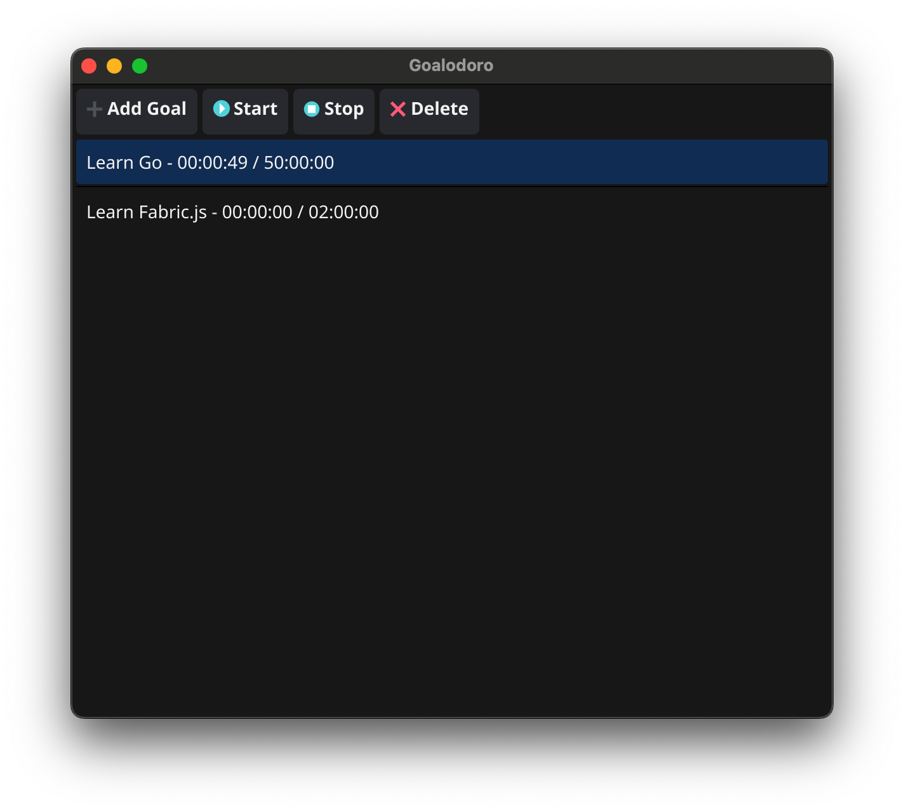

# Goalodoro
> A Goal-Focused Time Tracker

<!--  -->

<!--  -->

**What is Goalodoro?**  
A simple yet powerful desktop app built with Go and Fyne to help you set goals and track the time you spend on them. Ideal for anyone practicing deliberate learning or deep work. Real-time tracking, progress persistence, and a clean UI.

---

## 📝 About the project
A very simple solution for setting and tracking your goals, see your progress and most importantly stay on track and persistantly master your skills.

## 🔑 Key Features
- Tracking time spent on your goals
- Real-time tracking
- Progress persistence